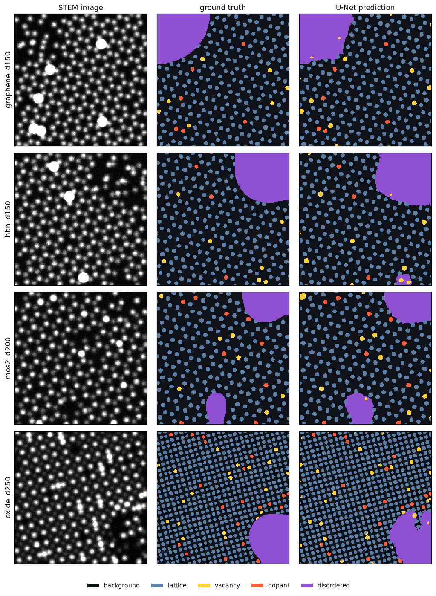
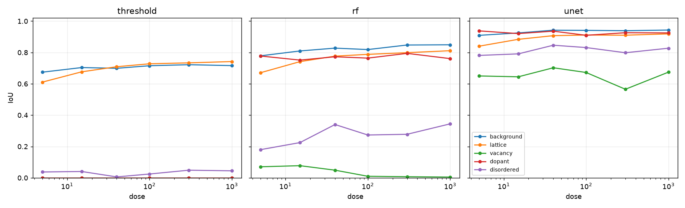

# stem-defect-segmentation

Pixel-level segmentation of point defects and local structure in simulated
atomic-resolution STEM. A physics-motivated simulator paints every pixel with
one of five classes, background, lattice, vacancy, dopant, and disordered, with
exact ground truth. Three methods segment it, a hand-built threshold-and-morphology
baseline, a random forest on local features, and a compact multi-class U-Net,
and each is scored with per-class IoU and Dice plus a boundary-localisation error.
Everything runs on CPU; every committed number regenerates from a fixed-seed
YAML config.



Four synthetic materials, each with a substitutional dopant (bright, saturated),
a scatter of vacancies, and an amorphous or grain-boundary region. The U-Net
prediction sits beside the exact ground truth. The class colours are fixed:
background is near-black, lattice is grey-blue, and the three rare classes are
the saturated yellow, red and purple.



Read the three panels left to right. The threshold baseline only ever recovers
background and lattice. The random forest adds dopants but its vacancy line sits
on the floor. The U-Net lifts every class, including the two that a local method
cannot reach.

## What the numbers say

Measured this session in a fresh CPU virtual environment against exact synthetic
ground truth. Full tables in [RESULTS.md](RESULTS.md); raw values in
`results/*.json`.

**Pixel accuracy is the wrong headline.** Background is about 70% of every frame,
so predicting "background everywhere" already scores 0.703 pixel accuracy while
getting every defect wrong (mean IoU 0.141). At dose 100 on graphene the
threshold baseline scores a nearly identical 0.735 pixel accuracy, yet its
rare-class mean IoU is 0.008. The whole benchmark leads with per-class IoU for
this reason.

| graphene, dose 100 | pixel accuracy | mean IoU | rare-class mean IoU |
|---|---|---|---|
| predict all background | 0.703 | 0.141 | 0.000 |
| threshold + morphology | 0.735 | 0.293 | 0.008 |
| random forest | 0.841 | 0.531 | 0.349 |
| U-Net | **0.957** | **0.853** | **0.804** |

**The vacancy class is where spatial context decides it.** A vacancy is defined
by the absence of a column in an otherwise ordered neighbourhood, so a local
classifier has almost no signal for it. The random forest's vacancy IoU is near
zero at every dose and actually falls as dose rises (0.070 to 0.005 from dose 5
to 1000). The U-Net holds vacancy IoU between 0.57 and 0.70 across the whole
range. Across the four materials the U-Net reaches vacancy IoU 0.45 to 0.58
where the random forest gets 0.01 to 0.10.

**The gap survives tuning the baseline to an oracle.** Giving the threshold
baseline the per-condition, ground-truth-optimal parameters (an upper bound it
could never reach in practice) lifts its rare-class IoU to only 0.02 to 0.04.
The U-Net's roughly 2.2x advantage over the balanced random forest is real, not
an artifact of an under-tuned baseline.

**Class imbalance inflates accuracy; boundary error tells the truth.** Growing
the disordered region from 2% to 35% of the frame, the U-Net's pixel accuracy
barely moves (0.94 to 0.97) while its disordered IoU climbs 0.61 to 0.89 and its
boundary-localisation error drops from 15 px to 3 px.

## The five classes

| code | class | what it is |
|---|---|---|
| 0 | background | vacuum and the interstitial matrix between columns |
| 1 | lattice | a well-ordered host atomic column |
| 2 | vacancy | the neighbourhood of a lattice site whose column is missing |
| 3 | dopant | a substitutional foreign column, brighter or fainter than its neighbours |
| 4 | disordered | an amorphous inclusion or grain-boundary region with no clean lattice |

## What is in the box

**Simulator** (`stemseg.sim`): projected 2D crystals with a multi-species basis,
four presets (graphene, hexagonal boron nitride, MoS2, a square perovskite-like
oxide). Column brightness is the sum of Z^1.7 over the atoms (incoherent
Z-contrast), blurred by a Gaussian probe. A heavy dopant simply saturates, which
is what a real detector does. Vacancies remove a column but keep its site
labelled; a disordered region is a smooth blob of heavily jittered, thinned
columns. Poisson shot noise is set by one dose parameter. The label map is built
from geometry, never from the noisy image, so it is exact.

**Methods** (`stemseg.classical`, `stemseg.net`): a threshold-and-morphology
pipeline, a random forest over a 15-channel local feature bank
(`stemseg.features`), and a three-level multi-class U-Net (about 0.48 M
parameters). The two learned models train on the same simulator, so the
comparison is fair.

**Metrics** (`stemseg.metrics`): per-class IoU and Dice (NaN, never zero, for a
class absent from both truth and prediction, so a mean never launders a missed
rare class), pixel accuracy, a full confusion matrix, and a symmetric
boundary-distance error for the disordered region.

**Benchmark harness** (`stemseg.benchmark`): four modes driven by YAML configs
with fixed seeds: parameter sweeps, per-material scoring, an operating-point
fair-tuning check, and confusion analysis. The six committed configs in
`configs/` regenerate every figure and table here.

## Install

Python 3.11. CPU-only PyTorch is sufficient.

```
python -m venv .venv
.venv\Scripts\activate          # Windows; source .venv/bin/activate elsewhere
pip install torch --index-url https://download.pytorch.org/whl/cpu
pip install -e ".[dev]"
```

## Quickstart

```
stemseg demo                                        # segment the 4 committed samples, all methods
stemseg simulate --material mos2 --dose 120 --figure sim.png
stemseg segment data/sample/graphene_d150.npz --method unet --figure overlay.png
stemseg gallery                                     # rebuild the hero gallery
stemseg benchmark configs/dose_sweep.yaml           # any committed benchmark
stemseg train --model both --steps 2500             # retrain U-Net + refit RF, minutes on CPU
```

The tutorial notebook (`notebooks/tutorial.ipynb`, committed executed) walks the
whole pipeline from simulation through classical and learned segmentation to the
final rare-class-IoU-versus-dose curve, with a visualization at every step. The
Python API is documented with runnable examples in [docs/api.md](docs/api.md);
the two models are documented in [models/MODEL_CARD.md](models/MODEL_CARD.md).

## Real images

The models are trained only on simulation, so on a real micrograph they give a
qualitative, ground-truth-free segmentation:

```
stemseg segment your_image.png --method unet --downsample 3 --figure overlay.png
```

No real image is committed (a cleanly licensed one matching the training
projection is not bundled here). The loader handles contrast normalisation,
optional inversion, and downsampling to match the trained column width; see
[data/real/README.md](data/real/README.md). Expect the domain gap described in
the model card.

## Repository layout

```
src/stemseg/     sim, features, classical, net, train, metrics, benchmark, plots, io, real, cli
configs/         six YAML benchmark configs, fixed seeds
models/          committed U-Net (.pt) and random forest (.pkl) + model card
data/sample/     four committed synthetic samples with label maps
data/real/       bring-your-own instructions (no committed image)
notebooks/       executed tutorial notebook
docs/            API documentation
figures/, results/  regenerable outputs of the committed configs
scripts/         figure generation and notebook build
tests/           47 pytest tests
```

## Scope and limitations

- The imaging model is incoherent Z-contrast with a Gaussian probe. No
  multislice dynamical scattering, no probe aberrations, no detector transfer
  function. Absolute numbers will not transfer to a real instrument.
- All training and evaluation data is synthetic. The models have never seen a
  real micrograph; the committed numbers are measured against exact synthetic
  ground truth only.
- The vacancy class is the hardest even in simulation, because it is defined by
  absence of signal. Even the U-Net recovers it only partially. Treat vacancy
  predictions with the most caution.
- The disordered-region boundary is localised to a few pixels at best; the
  reported boundary error quantifies this.

## Author

Aamir Malik

- GitHub: https://github.com/aamirmalik-dr
- LinkedIn: https://linkedin.com/in/dr-aamirmalik

## License

MIT for all code and synthetic data. See [LICENSE](LICENSE).
